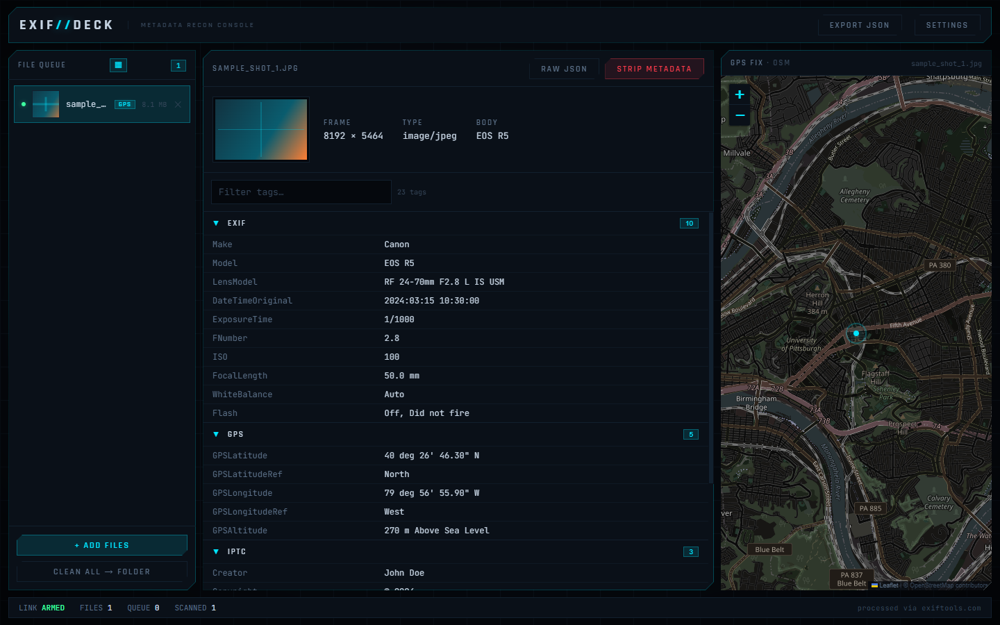

# EXIF//DECK

A futuristic, HUD-styled desktop app for inspecting, mapping, and stripping file
metadata. Drop in photos (or videos, audio, PDFs) and EXIF//DECK reads their EXIF /
IPTC / XMP tags, plots any embedded GPS coordinates on a map, and can remove all
metadata to produce a clean copy — all through a dark "camera viewfinder" interface.



## Features

- **Metadata inspector** — grouped, searchable EXIF / IPTC / XMP / File sections with
  click-to-copy values and a raw JSON view (with a one-click copy).
- **Batch processing** — drag in many files at once; a concurrency-limited queue scans
  them with per-file status, and results export to a single JSON file.
- **GPS mapping** — files with location data are flagged in the queue and plotted on a
  map re-styled to match the HUD. Choose your provider: **Mapbox**, **Google Maps**,
  or **OpenStreetMap** (free, no key).
- **Metadata removal** — strip all metadata from a file (or a whole batch) and save the
  cleaned copies.
- **Thumbnails** — an inspector preview strip plus optional thumbnails in the queue,
  generated locally by the OS thumbnail engine.

## How metadata is processed

EXIF//DECK is a client for the [exiftools.com](https://exiftools.com) API. Files are
uploaded to that service for extraction and cleaning (100 MB max per file); results
come back as JSON. You supply your own exiftools.com API key. GPS coordinates parsed
from the results are rendered locally by your chosen map provider.

## Setup

Requires [Node.js](https://nodejs.org) 18+.

```bash
npm install
npm run dev
```

On first launch the app opens **Settings** and asks for:

- an **exiftools.com API key** — required (get one at
  [exiftools.com/api-keys](https://exiftools.com/api-keys));
- a **map provider** and its key — Mapbox token or Google Maps key, or pick
  OpenStreetMap, which needs no key.

### Where keys are stored

Keys are **never** hard-coded or written into the repository. They are entered at
runtime and stored **encrypted** in your OS keystore via Electron's
[`safeStorage`](https://www.electronjs.org/docs/latest/api/safe-storage), in the app's
per-user data directory — not in the project folder. All API calls run in the Electron
main process, so the renderer never handles your keys directly.

## Build

```bash
npm run build      # compile main / preload / renderer
npm run package    # build a Windows installer (needs: npm i -D electron-builder)
```

## Tech stack

Electron · Vite · React · TypeScript · Mapbox GL JS · Leaflet (OpenStreetMap)

## License

[MIT](LICENSE)
